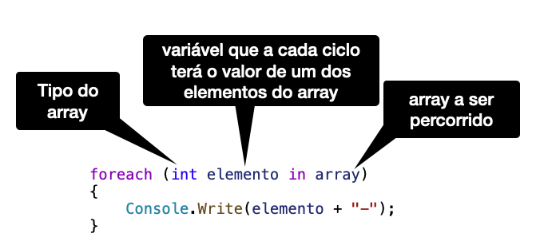

# Arrays
- São variáveis que armazenam **múltiplos valores** na mesma variável;
- Todos os valores devem ser do **mesmo tipo**;
- Esses valores, são armazenados enumeradamente em uma quantidade definida na criação do array;
- Para serem acessados precisam de um indexador, ou seja, um número que 
  diga qual a posição desejamos acessar.
- Em C# a 1a posição de um array é a posição 0


- No exemplo, o array tem 10 posições, onde:
```
    array[0] = 10     array[5] = 32
    array[1] = 11     array[6] = 19
    array[2] = 30     array[7] = 23
    array[3] = 45     array[8] = 56
    array[4] =  9     array[9] = 13
```


## Declarar, instanciar e inicializar
- Todos os exemplos estão em [Exemplo1.cs](src/Exemplo1.cs).

### Declarando um array:
- Declarar é dar conhecimento ao programa que existe uma variável e qual é o seu tipo; 
- Para declarar usamos as chaves `[]` para indicar um array:

  `int[] numeros;`
  
### Instanciando um array:
- Instanciar significa criar um espaço de memória para uma variável que precisa de mais memória,
  como um objeto, uma String ou um array;
- Os valores primitivos não precisam ser instanciados, mas qualquer coisa mais complexa sim.
- Os arrays têm tamanho fixo e é preciso **definir o tamanho** na instanciação:

  `numeros = new int[5];`

- O mais comum é declarar e instanciar um array na mesma linha:

  `int[] numeros = new int[];`

### Inicializando um array:

- Quando um array é instanciado, o Java já inicializa seus valores da seguinte forma:
  - números (inteiros e decimais): 0;
  - `char`: '\0' que é um caracter nulo;
  - `bool`: `false`
  - Tipos referência: `null`

- É possível inicializar o array já logo após a sua declaração, deixando implícito sua instanciação:
  
  `int[] numeros = {1,2,3,4,5};`

- É sempre possível colocar qualquer valor nas posições do array uma a uma:

  ```
  for(int i=0;i<5;i++)
    numeros[i] = i;
  ```

## Comprimento de um array:
- Em qualquer momento de um programa podemos verificar o tamanho de um array com a propriedade `Length` da forma:
  
  ```
        array.Length;
  ```
- Veja um exemplo em (ExemploLenght.cs)[src/ExemploLenght.cs]


## Percorrendo um array:
- Um array pode ser percorrido pelas suas **posições**:
  - com um `for` convencional;
  - com um `while` ou `do-while` associados a um contador;
  - e com um *forEach* ou *enhanced for*, que é um laço `for` adaptado para percorrer estruturas 
    com multiplos elementos como um array.
  
### foreach ou Enhanced for:



- Esse tipo de laço é para percorrimentos em que a posição dos elementos não é importante;
- Se precisarmos saber **onde** (qual posição um elemento ocupa), então esse laço não é adequado.
- O foreach **nunca altera os elementos percorridos**.
- Podemos utilizar `var` no lugar do tipo se ele for óbvio ou muito grande.
- Veja os exemplos comparados em [Exemploforeach.cs](src/Exemploforeach.cs)


## Limitações de arrays:

- Não é possível **alterar o tamanho** de um array após ser instanciado;
- Não é possível **remover/inserir valores** em um array, somente podemos sobrescrever os valores.
- Só é possível atribuir todos os valores de um array de uma só vez em sua declaração, 
  depois da declaração, só podemos **atribuir valores um de cada vez**;
- Como todos os objetos, se fizermos a atribuição de um array para outra variável, estamos apenas criando
  uma segunda variável para manipular **o mesmo array**.


## Exercícios:
1. Faça um programa crie um array com tamanho 10, coloque os valores de 1 até 10 em suas posições e exiba-o na tela
   em um laço diferente do laço da leitura;
2. Faça um programa que crie um array com tamanho 10, mas com os valores decrescentes de 10 até 1. Exiba-o na tela.
3. Faça um programa que pergunte o tamanho de um array, crie-o, leia seus valores e exiba-o na tela.
4. Faça um programa que crie um array com tamanho 5. Leia um número e insira os valores do array como potências do 
   número lido. Exemplo: n = 2, a[0] = 1, a[1] = 2, a[2] = 4, a[3] = 8, a[4] = 16. 
5. Faça um programa que dado o array {1, 2, 3, 4, 5, 6, 7, 8}, troque os valores das posições 2 a 2. Exemplo:
   Troque o valor da posição 0 pelo valor da 1. O valor da posição 2 pelo valor da 3, e assim sucessivamente, 
   de forma que o array termine {2, 1, 4, 3, 6, 5, 8, 7}.
6. Faça o mesmo que o exercício anterior, mas troque 1a posição pela última, a 2a pela penúltima e assim por diante
   até o meio do array.
7. Repita o exercício 5, mas troque as posições com superposição. Ou seja, troque:
   - 1a com a 2a;
   - 2a com a 3a;
   - 3a com a 4a;
   - ... 
   - 7a como a 8a.
8. Refaça o exercício 7, as somente se o 1o elemento da troca for maior que o 2o elemento da troca.


## Arrays Multidimensionais
- Arrays multidimensionais são utilizados para armazenar informações que são melhor representadas em
  estruturas multidimensionais como matrizes, mapas, tabelas, imagens...
- Observe o exemplo: uma empresa vende utensílios domésticos em várias cidades e tem o seguinte relatório de vendas
    de unidades por cidades:

|          |São Carlos     |Araraquara     |Rio Claro      |Ribeirão Preto |
|----------|---------------|---------------|---------------|---------------|
| Panelas  |        8000.00|           0.00|        1000.00|        6000.00|
| Copos    |        3000.00|        3000.00|        3000.00|        9000.00|
| Pratos   |        7000.00|        6000.00|        2000.00|        6000.00|
| Talheres |        5000.00|        1000.00|           0.00|        4000.00|
|  Xícaras |        6000.00|        9000.00|        1000.00|        8000.00|

- A melhor maneira de armazenar as informações de vendas é com um array bi-dimensional, onde as linhas
  representam os produtos e as colunas as cidades.
- Um array multidimensional tem a declaração similar a de um array uni-dimensional, mas com a representação
  também das demais dimensões;
- O exemplo a seguir declara e instancia um array bidimensional, de 3 linhas por 4 colunas de inteiros:

```
    int[][] matriz = new int[3][4];
```

- O número de elementos totais armazenado é obtido multiplicando-se o tamanho de cada dimensão. No
  exemplo anterior, temos 3 linhas e 4 colunas, ou seja, temos ao todo 3 x 4 = 12 elementos.
- Para acessar todos os elementos de um array multidimensionais, utilizamos laços encadeados, 
  um dentro do outro, um para cada dimensão da matriz.
- No programa [ExemploMatriz.cs](src/ExemploMatriz.cs) temos a leitura e a impressão de uma 
  matriz de 3x4 elementos.
- No programa [ExemploVendas.cs](src/ExemploVendas.cs) temos exemplos de inicialização de 
  arrays bidimensionais e percorrimentos por linhas e por colunas.


## Exercícios:
1. Faça um programa com uma matriz bidimensional de 2x12 de double's onde a primeira linha 
   teremos as receitas de uma empresa nos 12 meses do ano. E na segunda linha teremos as 
   despesas dessa mesma empresa, também mês a mês. Crie um array de 12 posições e armazene o
   saldo (receita-despesa) de cada mês.
2. Complemente o ExemploVendas mostrando o total de vendas total (todas as peças em todas as cidades).
3. Utilize os arrays de ExemploVendas para fazer um programa que leia um produto e uma cidade e diga
   quanto foi a venda daquele produto naquela cidade.


